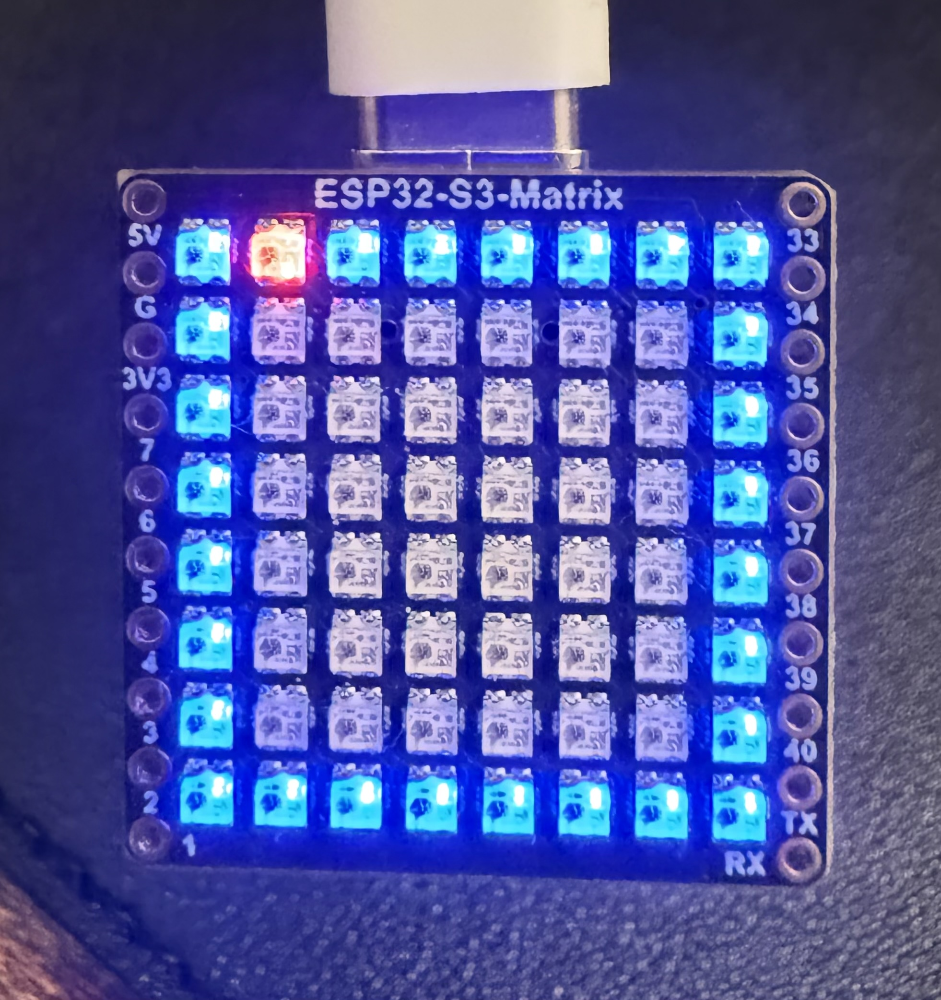
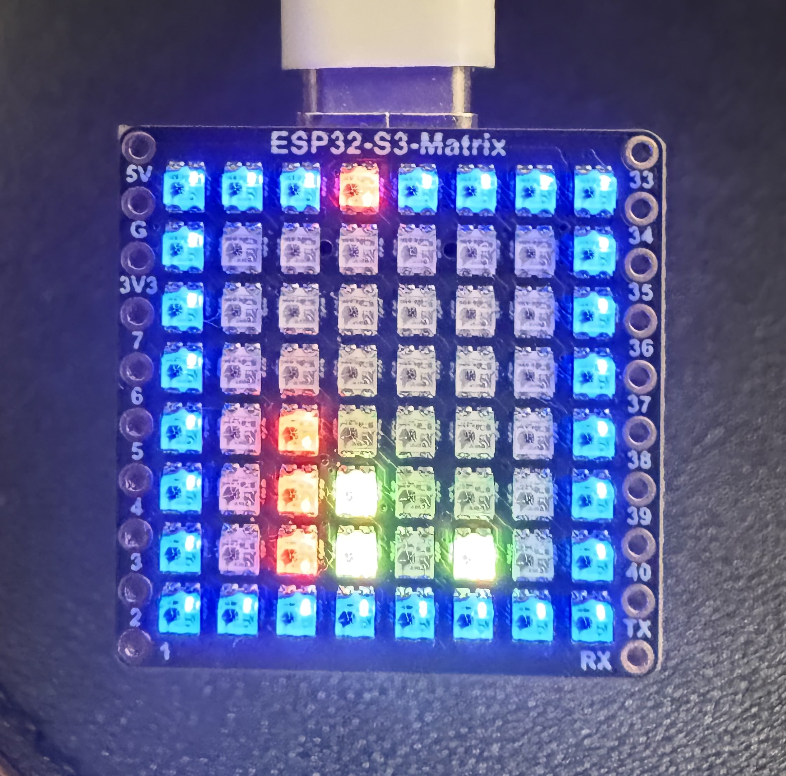

# Connect-4

Connect 4 on a 8x8 RGB LED matrix ESP32 development board with single-button controls and OTA update support; firmware detects wins and triggers an animation before restarting the game.

---

## Hardware

- **[Waveshare ESP32-S3-Matrix](https://www.amazon.com/dp/B0D3DPLFL8?linkCode=ssc&tag=mayaodom-20&creativeASIN=B0D3DPLFL8&asc_item-id=amzn1.ideas.1A2BJ4L5BZ0LU&ref_=aip_sf_list_spv_ofs_mixed_d_asin)** — ESP32-S3 development board with onboard 8×8 RGB LED matrix, Wi-Fi, and Bluetooth LE
- Single push button (all controls)

| On Reset / Upload | Mid-Game |
|:---:|:---:|
|  |  |

---

## How It Works

Two players take turns dropping pieces into a 6-column, 6-row grid displayed on the 8x8 LED matrix — the outer ring of LEDs forms a border, leaving the inner 6x6 area as the play field. A single button handles all input: single press moves the cursor right along the top row, double tap drops a piece into the selected column, and holding moves the cursor back left. The firmware detects four-in-a-row wins horizontally, vertically, and diagonally, then triggers a win animation before automatically restarting.

**OTA (Over-the-Air) updates** are supported via PlatformIO, so you can flash new firmware wirelessly after initial setup.

**Companion App** — the firmware sends live board state updates over BLE to a Connect 4 mobile app. The app is a separate project and will be linked here once it's published to the repo.

---

## Getting Started

### Prerequisites

- [PlatformIO](https://platformio.org/) (VS Code extension or CLI)
- Wi-Fi network credentials (see **Secrets File** below)

### 1. Clone the Repository

```bash
git clone https://github.com/EastMarketSideProjects/Connect-4.git
cd Connect-4
```

### 2. Create a Secrets File

This project uses Wi-Fi for OTA updates. You must create a `secrets.h` file in the `src/` directory before building. This file is listed in `.gitignore` and should **never** be committed.

Create `src/secrets.h` with the following content:

```cpp
#pragma once

#define WIFI_SSID     "your_wifi_ssid"
#define WIFI_PASSWORD "your_wifi_password"
```

Replace `your_wifi_ssid` and `your_wifi_password` with your actual Wi-Fi credentials.

### 3. Build & Upload (Initial Flash)

For the first upload, connect the board via USB and run:

```bash
pio run --target upload
```

### 4. OTA Updates

After the initial flash, the board will be discoverable on your network as `connect4.local`. Subsequent uploads can be done wirelessly:

```bash
pio run --target upload
```

PlatformIO is already configured in `platformio.ini` to use OTA:

```ini
upload_protocol = espota
upload_port = connect4.local
```

Make sure your computer and the ESP32 are on the same Wi-Fi network.

---

## Controls

| Action | Input |
|---|---|
| Move cursor right | Single press |
| Drop piece in current column | Double tap |
| Move cursor left | Hold |

---

## Project Structure

```
Connect-4/
├── src/
│   ├── main.cpp          # Main game loop and logic
│   ├── Board.h / .cpp    # LED matrix rendering and game state
│   ├── Bluetooth.h / .cpp# BLE communication for companion app
│   ├── Buttons.h / .cpp  # Button input and gesture detection
│   ├── OTA.h / .cpp      # Over-the-air update handling
│   ├── Comms.h           # Shared communication interfaces
│   └── secrets.h         # ⚠️ You create this — not included in repo
├── .gitignore
├── platformio.ini
└── README.md
```

---

## Dependencies

Managed automatically by PlatformIO:

- [Adafruit NeoPixel](https://github.com/adafruit/Adafruit_NeoPixel) `^1.15.1`
- [NimBLE-Arduino](https://github.com/h2zero/NimBLE-Arduino) `^2.3.7`

---

## PlatformIO Config

```ini
[env:esp32-s3-devkitc1-n4r2]
platform = espressif32@6.6.0
board = adafruit_feather_esp32s3
upload_protocol = espota
upload_port = connect4.local
framework = arduino
lib_deps =
    adafruit/Adafruit NeoPixel@^1.15.1
    h2zero/NimBLE-Arduino@^2.3.7
```